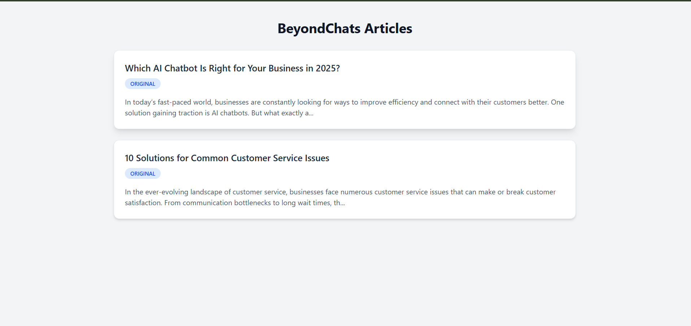
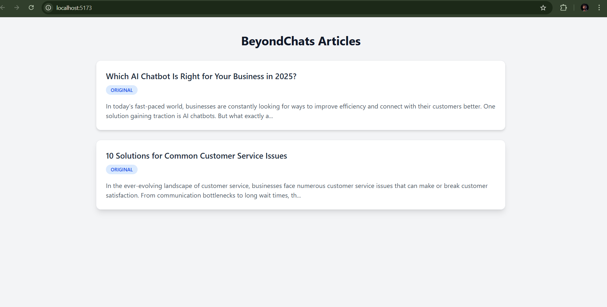

# 🚀 BeyondChats Assignment – Full-Stack Application

🔗 **GitHub Repository**  
https://github.com/waquaralipatel/Assignment-BeyondChats

---

## 📌 Project Overview

This project is a **phase-wise full-stack application** developed as part of the **BeyondChats technical assessment**.

The system performs the following tasks:

- Scrapes BeyondChats blog articles
- Stores articles in MongoDB
- Enhances articles using an AI pipeline (real or mocked)
- Displays original and updated articles on a React frontend

The application follows a **modular, scalable, and clean architecture**, divided into three connected phases.

---

## 🧠 Complete Application Architecture (Data Flow)

BeyondChats Blog Pages
↓
Phase 1 – Backend
(Blog Scraper + REST APIs)
↓
MongoDB Database
(beyondchats)
↓
Phase 2 – AI Pipeline
(Content Enhancement)
↓
Phase 3 – Frontend UI
(React Application)


This diagram provides a quick overview of the **end-to-end data flow** from scraping to UI rendering.

---

## 🧩 Phase Breakdown

### 🟥 Phase 1 – Backend (API + Scraper)
- Scrapes BeyondChats blog articles using Axios and Cheerio
- Stores data in MongoDB
- Exposes REST APIs (`/api/articles`)

**Tech Stack:** Node.js, Express.js, MongoDB, Mongoose, Axios, Cheerio

---

### 🟧 Phase 2 – AI Pipeline
- Fetches articles from backend APIs
- Enhances content using AI (or mocked AI logic)
- Updates enhanced articles back into MongoDB

**Tech Stack:** Node.js, Axios, OpenAI API (or mock logic)

---

### 🟩 Phase 3 – Frontend (React UI)
- Fetches articles from backend
- Displays articles as responsive cards
- Handles loading and error states safely

**Tech Stack:** React (Vite), Axios, Tailwind CSS

---

## ⚙️ Local Setup Instructions

### Prerequisites
- Node.js (v18 or later)
- MongoDB (local or MongoDB Compass)
- Git

---

### Step 1: Clone the Repository
```bash
git clone https://github.com/waquaralipatel/Assignment-BeyondChats.git
cd Assignment-BeyondChats


##Step 2: Phase 1 – Backend Setup

cd backend-laravel
cp .env.example .env
npm install
cd src
node app.js

##Run scraper (one-time):

node scraper/scrapeOldBlogs.js

##nStep 3: Phase 2 – AI Pipeline Setup

cd ai-node-script
cp .env.example .env
npm install
node index.js

If OpenAI quota is unavailable, AI rewriting is safely mocked.

##Step 4: Phase 3 – Frontend Setup

cd frontend-react
cp .env.example .env
npm install
npm run dev

**Open in browser:**
http://localhost:5173  

```

---
## 🔁 Correct Execution Order

1️⃣ Backend Server   → node app.js
2️⃣ Blog Scraper     → node scraper/scrapeOldBlogs.js
3️⃣ AI Pipeline      → node index.js
4️⃣ Frontend UI      → npm run dev

---
##📸 Frontend Output (Application Result)




---


##🖼 Articles List – Original Articles

Explanation:

Articles scraped from BeyondChats are displayed as cards

Each card shows title, preview content, and article type

The ORIGINAL badge confirms raw scraped content

Validates Phase 1 backend and MongoDB integration

---

##🖼 Multiple Articles Rendered

Explanation:

Confirms multiple articles are stored and retrieved

Data is fetched using /api/articles

React frontend renders content correctly

Demonstrates complete backend–frontend connectivity

---

##🌐 Live Frontend Application

🔗 Live URL: Currently not deplyed,clone and follow the running steps of apliction

Deployment-ready. it's runs locally.

http://localhost:5173


The frontend allows viewing:

Original articles

Updated articles (after AI pipeline execution)

---

## Final Submission Summary

This project demonstrates:

Full-stack development expertise

Clean REST API design

Web scraping and data normalization

AI pipeline orchestration (real or mocked)

Robust frontend–backend integration

Clear documentation and architecture

The application is fully functional end-to-end and meets all assessment requirements.

---

## 👨‍💻 Author

Waquar Ali
🎓 CMR Institute of Technology, Hyderabad
🔗 GitHub: https://github.com/waquaralipatel
